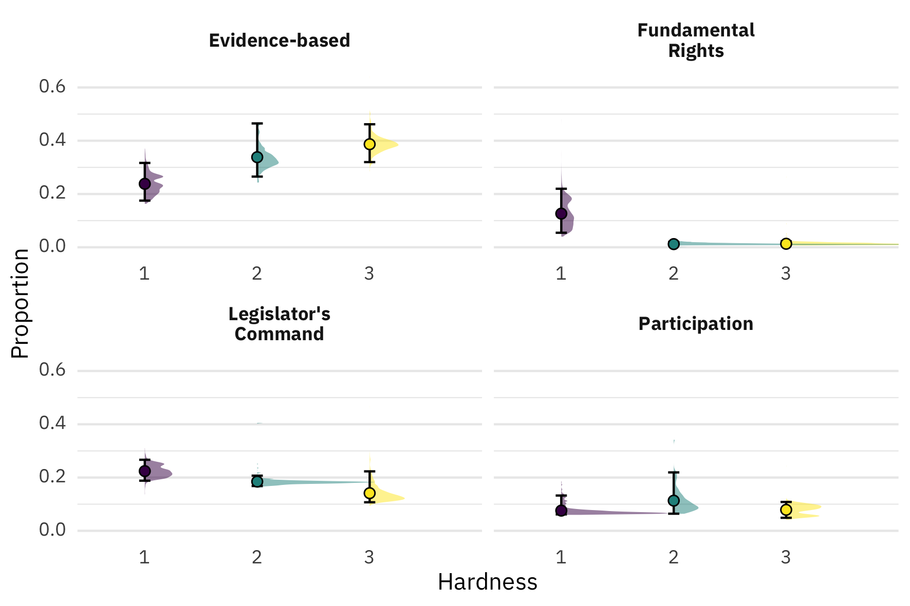

# Beyond Expertise: Examining the Public Legitimacy of EU Agencies

Replication data and scripts. 

**Please note:** It is unfortunately not possible to download or clone the anonymized version of this repository. You may browse and download individual files. If you are a reviewer and want a zip file of the full repository, please contact the Editor. 

## What's what

* `R/`: Scripts for the figures and analysis: `figure-1.R`, `replication-script.R`, and `analysis_3.R`
* `R/`: A function to parse excel files generated by Retriever (`read_retriever_xlsx.R`). Sourced by `replication-script.R`. You don't need to open and run this manually. 
* `data/`: Datasets. Term frequencies for all dictionaries and articles are in `dt_hits.csv`. Full text of articles are removed, but if you have a Retriever or Mediearkivet subscription, they should be accessible via the URLs in the `url` column. 
* `final-searches/`: Excel files from generated by Retriever. These are read by `replication-script.R` and should not be changed manually. 
* `plots/`: Plots generated by the code. Will be overwritten when you run the scripts.
* `appendix/`: Source files for the [Online Appendix](appendix/online-appendix.pdf).

## How to run

* Clone or download this repository. 
* Set your `R` working directory to the top-level folder, or simply open the `public-legitimacy-replication.Rproj` file. 
* Run the scripts in the folder `R/`.

***

